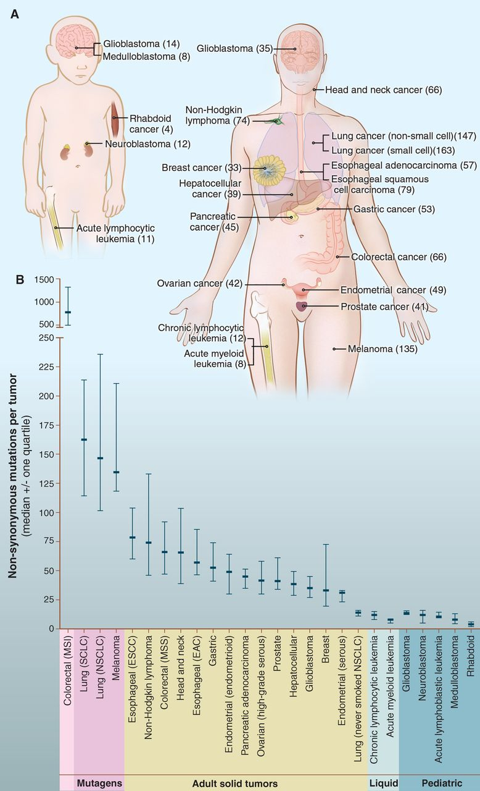
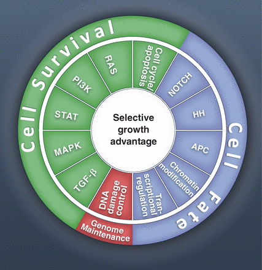
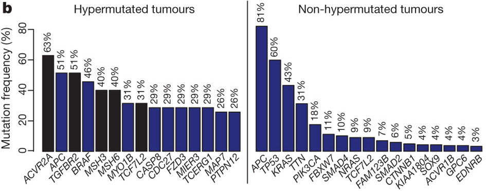
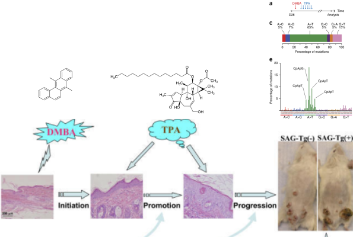

background-image: url(http://img2.tfd.com/mk/C/X2604-C-11.eps.png)

```{r setup, include=FALSE}
knitr::opts_chunk$set(echo = FALSE, message = FALSE, fig.align = 'center', out.width = '80%')
library(magrittr)
library(tidyverse)
library(broom)
library(reshape2)
library(ggthemes)
```


---
class:inverse, middle, center

# Recap

---

## Senesents

- Onkogeen indutseeritud senesents on tuumorsuppressor mehhanism mis toimib healoomulised kasvajates.
- OI senesentsi käivitavad mitogeenne hüperstimulatsioon (RAS, E2F1) ja on tingitud tekkivatest DNA kahjustustest.
- Rakkude senesentsi võib põhjustada erinevat tüüpi stress.

```{r}
knitr::include_graphics("http://www.nature.com/nrc/journal/v6/n6/images/nrc1884-f1.jpg")
```

---
## Telomeerid ja immortalisatsioon

- Telomeerid on DNA-valk kompleksid, mis stabiliseerivad lineaarsed kromosoomide otsad.
- Imetajate telomeerid koosnevad 5-15 kb pikkustest TTAGGG kordusjärjestustest, mis lõppevad 3' üheahelalise overhang-iga.
- Telomeeride pikkus määrab rakkude replikatiivse potentsiaali ja toimib tuumorsuppressor mehhanismina.
- Telomeeride pikkuse säilitamise eest vastutab telomeeraas (TERT) või alternative telomere length (ALT) korrastus-mehhanism, mis põhineb rekombinatsioonil (>10% vähirakkudel).
- Rakkude immortaliseerimiseks on neis vaja aktiveerida telomeraas.
- 60-80% inimese vähkidest on telomeraas positiivsed.

---
class:inverse, middle, center

# Mitmeastmeline vähiteke

---
## Vähiteke on pikajaline protsess

- USA andmete põhjal on 70 a. mehel 1000 korda kõrgem risk surra käärsoole vähki kui 10 a. poisil.
- Sporaadiline vähk on vana ea haigus ja sellest lähtuvalt võtab pahaloomulise vähi teke ilmselt aega kümneid aastaid.

.pull-left[

```{r}
uk <- read.csv("data/UKage") %>% 
  melt(id = "Vanusegrupp") 
uk$Sugu<-"Naised"
uk$Sugu[grep("Meeste", uk$variable)]<-"Mehed" 
uk$variable <- gsub("^[MestNai.]{7}","",uk$variable)
ggplot(uk,aes(x=Vanusegrupp, y=value, fill=Sugu)) + 
  geom_bar(stat="identity", position="dodge") + 
  facet_wrap(~variable, scale="free_y") + 
  scale_fill_colorblind() +
theme(axis.text.x=element_text(angle=90,color="black")) + 
  ylab("") +
  ggtitle(paste(strwrap("Kõik vähid (C00-C97 välja arvatud C44). \nKeskmiselt uusi vähijuhtumeid aastas ja \nintsidents 100000 inimese kohta, UK, 2009-2011.", width = 50), collapse="\n"))  
```

]

.pull-right[

```{r}
seer <- read.csv("data/SEER")
seer %>%  melt(.,id="Vanusegrupp",value.name="intsidents",variable.name = "Sugu") %>%
  ggplot(.,aes(x=Vanusegrupp, y=intsidents, fill=Sugu)) + 
  geom_bar(stat="identity", position="dodge") + 
  scale_fill_colorblind() +
  scale_x_discrete(limits=rev(levels(seer$Vanusegrupp))) +
  theme(axis.text.x=element_text(angle=90,color="black")) +
  ggtitle("Vanus-korrigeeritud vähi intsidents, USA 2007-2011") + 
  xlab("")
```

]

.footer[ Andmed: Vasakul, 
<a href="http://www.cancerresearchuk.org/cancer-info/cancerstats/incidence/age/">
Cancer Research UK
</a> ja paremal, 
<a href="http://seer.cancer.gov/csr/1975_2011/browse_csr.php?sectionSEL=2&pageSEL=sect_02_table.07.html#table1">
SEER Cancer Statistics Review 1975-2011.
</a>
]

---
## Kasvaja progressioon

- Pahaloomulise vähi teke võtab aega aastakümneid.
- Protsessi mille jooksul normaalsed rakud omandavad järk-järguliselt neoplastilise fenotüübi nimetatakse **vähi/tuumori/kasvaja progressiooniks**.
- Kasvaja progressioon põhineb rakkudes järjestikustelt akumuleeruvatel juhuslikel geneetilistel või epigeneetilistel mutatsioonidel rakkude jagunemist, ellujäämist ja muudes pahaloomulist fenotüüpi reguleerivates geenides.
- Iga järgnev mutatsioon kujutab endast järgmise barjääri murdumist pre-maliigse raku teel pahaloomulise kasvuni.

---
## Vähitekke pikaajalisus: suitsetamise mõju kopsuvähi levikule USA-s


.pull-left[
```{r}
knitr::include_graphics("http://www.nature.com/nrc/journal/v1/n1/images/nrc1001-082a-f3.gif")
```

]

.pull-right[

- Kuni II maailmasõjani oli suitsetamine USA meeste seas vähelevinud.
- 30-35 aastat hiljem, 1970ndate aastate paiku, hakkas kopsuvähi intsidents järsult tõusma.
- Praegu on ülemaailmne kopsuvähi suremus ~1.39 miljonit aastas, tipp peaks saabuma 2020-30-ndtate aastate paiku.

```{r, out.width='50%'}
knitr::include_graphics("http://picturingtheamericandream.files.wordpress.com/2011/11/swscan01337-copy.jpg")
```
]

.footer[ Andmed:
<a href="http://www.nature.com/nrc/journal/v1/n1/full/nrc1001-082a.html">
Tobacco and the global lung cancer epidemic.
</a>
]

---
## Vähi suremus on lineaarselt seotud vanusega

.pull-left[

```{r, out.width='100%'}
eurorate <- read.csv("data/eurorate.csv") %>% 
  melt(.,id = "Vanusegrupp") %>% 
  filter(value > 2 & !variable == "Hodgkin.s.lümfoom")
cancers <- eurorate  %>%
  group_by(variable) %>%
  nest %>% 
  mutate(model = map(data, ~glm(value ~ log(Vanusegrupp), family=quasipoisson(), data =.)),
         slope = map_dbl(model, function(x) coef(x)[2]),
         y = map_dbl(data, function(x) max(x$value)/2))
ggplot(eurorate, aes(x = Vanusegrupp, y = value)) + 
  geom_point() + 
  facet_wrap(~ variable, scales = "free_y") + 
  scale_y_log10() + 
  scale_x_log10() + 
  scale_x_continuous(breaks = c(25, 50, 75)) +
  geom_smooth(method = "lm", se = FALSE) +
  geom_text(data = cancers, aes(x = 25, y = y, label = paste0("Tõus=", sprintf('%2.1f', slope))), size = 4, hjust = 0) +
  xlab("Vanus, aastat") + 
  ylab("Surmasid 100000 inimese kohta") +
  ggtitle("WHO EUROPE REGION (EURO) - \nBOTH SEXES ESTIMATED INCIDENCE BY AGE")
```

]

.pull-right[

- Kui sündmuse tõenäosus on $a^n$, siis sellise sündmuse toimumiseks peab aset leidma *n+1* juhuslikku sündmust suhteliselt sarnaste ajaliste vahedega.
- Selline seos muutujate vahel on Log-log skaalas lineaarne. 
- Keskmine tõus vähi suremuses kui vanus kasvab ühe ühiku kõrvalolevate andmete põhjal on **`r sprintf('%2.1f', prod(cancers$slope)^(1/length(cancers$slope)))`**.
- Siit nähtub, et pahaloomulise vähi tekkeks on vaja keskmiselt 5 + 1 = **6 sõltumatut sündmust**. 

]

.footer[ Andmed:
<a href="http://globocan.iarc.fr/Default.aspx">
GLOBOCAN 2012, IARC - 10.11.2014.
</a>
]

---
## Tee vähi suunas toimub läbi elu

- Soolevähi intsidents tõuseb tugevalt seitsmendal ja kaheksandal eludekaadil.
- Seega, iga samm või sündmus vähi suunas toimub kord **5 kuni 10 aasta** jooksul.
- Kogu protsess võtab aega 20 kuni 40 aastat.
- Siit nähtub, et **koos vanusega tekib meisse kõigisse paratamatult ka rakke, mis on juba läbinud mingi arvu (kuid mitte kõiki!) vähi tekkeni viivaid astmeid**.


```{r, out.width='50%'}
read.csv("data/eurorate.csv") %>% 
  melt(id = "Vanusegrupp") %>% 
  filter(value > 2 & variable == "Sool") %>%
ggplot(aes(Vanusegrupp, value)) + 
  geom_line(size = 2) + 
  xlim(0, 80) + 
  labs(title = "Soolevähk",
       x = "Vanus, aastates",
       y = "Surmasid 100000 inimese kohta")
```

---
## Osa vähke ei sõltu vanusest

- Inimse mesotelioomide (vasakul, tekib asbesti sisse hingamisel ja suitsetamisest) ja hiire nahavähi (benzo[*a*]püreeniga naha värvimisel) epidemioloogiline analüüs näitab, et **välised kantserogeenid on võimelised vähki indutseerima kindla ajakava alusel**.
- Ka kopsuvähi intsidents sõltub pigem suitsetamise staazhist kui vanusest ja suitsetamise maha jätmisel risk enam ei suurene. 

```{r, out.width='60%'}
knitr::include_graphics("http://www.nature.com/nature/journal/v411/n6835/images/411390ac.2.jpg")
```

.footer[ Pilt:
<a href="http://www.nature.com/nature/journal/v411/n6835/full/411390a0.html">
Cancer epidemiology in the last century and the next decade.
</a>
]

---
## Somaatiliste mutatsioonide arv inimese vähkides


.pull-left[

```{r, out.width='60%'}

```

]

.pull-right[

- **Välistest mutageenidest tingitud kasvajad sisaldavad rohkem mutatsioone.**
- Ülal, mittesünonüümsete mutatsioonide arv tuumori kohta eri paikmetes täiskasvanute ja pediaatriliste vähkide täisgenoomi sekvenerimise andmetel. 
- All, mittesünonüümsete mutatsioonide mediaan erinevates vähitüüpides. Vurrud näitavad diagrammil 25 ja 75% kvartiile. 

]

.footer[ MSI, microsatellite instability; SCLC, small cell lung cancers; NSCLC, non–small cell lung cancers; ESCC, esophageal squamous cell carcinomas; MSS, microsatellite stable; EAC, esophageal adenocarcinomas. Pilt:
<a href="http://www.sciencemag.org/content/339/6127/1546/F1.large.jpg">
Number of somatic mutations in representative human cancers.
</a>
]

---
## Juhtmutatsioonid ja reisijamutatsioonid

- **Mutatsioonid, mis annavad tulevasele vähirakule selektiivse eelise nimetatakse juht- või draivermutatsioonideks (*driver*).**

- Enamus mutatsioone (>99.9%), mis vähis tekivad ei oma selektiivset tähtsust ja lihtsalt kanduvad "reisijatena" (*passenger*) edasi (sh. punktmutatsioonid, koopiarvu muutused, translokatsioonid ja epigeneetilised muutused üle terve genoomi).

- Iga juhtmutatsioon annab tulevasele vähirakule lisa 0.4% suuruse tõusu jagunemise ja apoptoosi vahekorras, mis ühe-kahe jagunemise korral nädalas viib aastate jooksul suure vähimassi (>10^9 rakku) tekkeni.

---
## Juhtmutatsioonid

.pull-left[

- Praeguseks on leitud, et eksisteerib umbes [140 geeni](drivers.html) mille mutatsioonid kontributeerivad olulise osa vähkide tekkesse ja arengusse.
- __*Driver* geenid__ toimivad kümnekonnas signaalirajas ja reguleerivad kolme põhilist rakulist protsessi: **raku diferentseerumine, raku ellujäämine ja genoomi korrashoid**.
- Iga individuaalne vähk erineb oma geneetiliste muutuste poolest, kuid muutunud signaalirajad on samad.

]

.pull-right[

```{r}

```

]

.footer[ Pilt:
<a href="http://www.sciencemag.org/content/339/6127/1546.full">
Cancer Genome Landscapes.
</a>
]

---
## Mitmeastmelise vähi histopatoloogia: soolevähk

```{r, out.width='60%'}
knitr::include_graphics("figures/CRCstages.jpg")
```

.pull-left[
- Tuumorid arenevad aja jooksul healoomulisest seisundist kartsinoomideni akumuleerides mutatsioone.
- Kõige esimene *"gatekeeping"* mutatsioon annab jagunevale normaalsele epiteelirakule selektiivse eelise.
- Soolevähis toimuvad sellised *gatekeeping* mutatsioonid **APC** geenis (LOH kr. 5q). 

]

.pull-right[

- Selline adenoom kasvab aeglaselt, kuid **sekundaarne KRAS mutatsioon** põhjustab teise ringi klonaalse ekspansiooni (kasvu). 
- Ainult APC mutatsiooni kandvad võivad küll alles jääda, kuid nende arv on väike võrreldes APC-KRAS mutantidega. 
- Edasised klonaalsed ekspansioonid on seotud mutatsioonidega PIK3CA, SMAD4 (LOH kr. 18q21) ja TP53 (LOH kr. 17p) geenides ning viivad pahaloomulise vähi tekkeni.
]

.footer[ Pilt:
<a href="http://www.sciencemag.org/content/339/6127/1546.full">
Cancer Genome Landscapes.
</a>
]

---
## Mitmeastmelise kartsenogeneesi mudel, HNSCC


- Tüvirakk muteerub ja tütarrakkudest moodustub muteerunud rakkude lapike (**patch**).
- Kahjustatud lapike kasvab ja asendab terves piirkonnas normaalse epiteeli (**field**).
- Kahjustuse suurenedes tekivad muteerunud subkloonid. 
- Mõnest divergeerunud kloonist areneb välja invasiivne vähk.


```{r}
knitr::include_graphics("http://www.nature.com/nrc/journal/v11/n1/images/nrc2982-f4.jpg")
```


.footer[Allikas:
<a href="http://cancerres.aacrjournals.org/content/63/8/1727.long#ref-1">
Braakhuis, 2003
</a> ja
<a href="http://www.nature.com/nrc/journal/v11/n1/full/nrc2982.html">
Leemans, 2011.
</a>
]


---
## Iga vähk on läbinud unikaalse muutuste raja

Geneetiliste muutuste jada, mis viib pahaloomulise vähi tekkeni, pole siiski korrastatult lineaarne ja kindla järjekorraga vaid on pigem igas kasvajas unikaalne.

- Soolevähid küll saavad suure (>80%) tõenäosusega alguse APC geeni mutatsioonidest, kuid edasine areng on stohhastiline.
- Varieeruvusest annab aimu *driver* geenide mutatsioonisagedused.

```{r}

```

.footer[ Pilt:
<a href="http://www.nature.com/nature/journal/v487/n7407/full/nature11252.html">
Comprehensive molecular characterization of human colon and rectal cancer.
</a>
]

---
## Kompleksne klonaalne evolutsioon vähis

Barretti söögitoru (BE) areng kartsinoomiks sisaldab TP53 ja CDKN2A mutatsioone ning rekurentseid LOH-e (5q, 9p, 13q, 17p, 18q).

```{r, out.width='70%'}
knitr::include_graphics("http://www.nature.com/ng/journal/v22/n1/images/ng0599_108.gif")
```

.footer[ Pilt:
<a href="http://www.nature.com/ng/journal/v22/n1/full/ng0599_106.html">
Barrett et al., 1999.
</a>
]

---
## *Field cancerization*, vähiala

- Mingis piiratud anatoomilises piirkonnas rohkelt tekkivad vähikolded pärinevad samast neoplastilisest alast.
- 1953, [Slaughter et al.](http://cancerres.aacrjournals.org/external-ref?access_num=13094644&link_type=MED) kasutasid mõistet **vähiala** (*field cancerization*) suuõõne vähi kirjeldamisel.
- Slaughter et al. tegid suuvähi histoloogilisel analüüsil sellised järeldused:
    - suuõõne vähk areneb multifokaalsetest vähieelsetest seisunditest,
    - vähki ümbritseb ebanormaalne kude,
    - suuõõne vähk koosneb mitmetest sõltumatutest kahjustustest, mis mõnikord on ka kokku kasvanud,
    - ebanormaalse koe säilimine peale kasvajate eemaldamist võib seletada sekundaarsete primaarsete tuumorite teket ja lokaalset relapsi.

---
## Vähiala on kirjeldatud erinevates kasvajatüüpides

Vähipaikmed, mille puhul on kirjeldatud vähiala efekt ja kus on jälgitav mitmeastmeline tumorigenees: 
- **suuõõs, neel**: tubaka tarvitamine 4-10 a. $\to$ düsplastiline suu leukoplakia 5-15 a. $\to$ vähk; 
- **kops**: 20 kuni 40 paki aastat (1 pakk päevas) $\to$ vähk; 
- **emakakael**: CIN1 9-13 a. $\to$ CIN3/CIS 10-20 a. $\to$ vähk; 
- **käärsool**: 15-20 a. $\to$ adenoom 5-15 a. $\to$  vähk; 
- **rind**: atüüpiline hüperplaasia $\to$ DCIS 6-10 a. $\to$ vähk; 
- **eesnääre**: 20 a. $\to$ PIN $\ge$10 a. $\to$ latentne vähk 3-15 a. $\to$ vähk. 
- kusepõis, söögitoru, vagiina, nahk;

.footer[CIS, <em>carcinoma in situ</em>; CIN, <em>cervical intraepithelial neoplasia</em>; DCIS, <em>ductal carcinoma in situ</em>; PIN, <em>prostatic intraepithelial neoplasia</em>.
]

---
## Vähiala soolevähis

.pull-left[

Lahti lõigatud värskelt opereeritud käärsoole osa milles on kartsinoom ja neli polüüpi. Diagramm näitab võimalikku defektset ala sooles, mis eelneb vähitekkele ja soodustab vähiteket. Diagrammil on värviga näidatud ka vähi sub- ja sub-subkloonid.
]

.pull-right[

```{r}
knitr::include_graphics("http://upload.wikimedia.org/wikipedia/commons/thumb/e/e8/Image_of_resected_colon_segment_with_cancer_%26_4_nearby_polyps_plus_schematic_of_field_defects_with_sub-clones.jpg/640px-Image_of_resected_colon_segment_with_cancer_%26_4_nearby_polyps_plus_schematic_of_field_defects_with_sub-clones.jpg")
```
]

.footer[ Allikas:
<a href="http://en.wikipedia.org/wiki/Carcinogenesis">
Wikipedia.
</a>
]

---
## Kasvaja geneetiline heterogeensus

- Kasvajasisene geneetiline heterogeensus peamine mehhanism, millel põhineb vähi progressioon ja ravimiresistentsus.

- Kaks alternatiivset hüpoteesi heterogeensuse kohta:
    - klonaalne evolutsioon vähis, 
    - vähi tüvirakkude hüpotees.

---
## Topography of cancer subclones

```{r}
knitr::include_graphics("http://www.nature.com/nature/journal/v481/n7381/images/nature10762-f4.2.jpg")
```

a, Tissue section of prostate to detect genetic events: TMPRSS2–ERG fusion (ERG via rearrangement (ERGR)) and PTEN loss. b, The presumed sequence of clonal events.


.footer[ Allikas:
<a href="http://www.nature.com/nature/journal/v481/n7381/full/nature10762.html">
Clonal evolution in cancer.
</a>Edel, TMPRSS2–ERG fusion by deletion or split (Esplit). TMPRSS2–ERG fusion by deletion of genomic sequences between the tandemly located TMPRSS2 and ERG gene sequences on chromosome 21. Duplication of the fusion of TMPRSS2 to ERG sequences together with interstitial deletion of sequences 5′ to ERG (called ‘2+Edel’).
]

---
## Vähi subkloonid

```{r}
knitr::include_graphics("https://www.dovepress.com/cr_data/article_fulltext/s54000/54184/img/fig4.jpg")
```

---
## Klonaalne evolutsioon vähis

- "Darwinlik" evolutsioonimudel võiks kirjeldada ka muutsi vähirakkude populatsioonis.
- Vähi ja ümbritseva koe mikrokeskkond tingib selektiivse pressi geneetiliselt heterogeensetele vähikloonidele.
- Ekspandeeruvad (ja uusi mutatsioone akumuleerivad) ainult need kloonid, millel esinevad antud mikrokeskkonnas jagunemiseks ja ellujäämiseks vajalikud omadused.

```{r}
knitr::include_graphics("http://www.nature.com/nature/journal/v481/n7381/images/nature10762-f2.2.jpg")
```

.footer[ Allikas:
<a href="http://www.nature.com/nature/journal/v481/n7381/full/nature10762.html">
Clonal evolution in cancer.
</a>
]

---
## Vähi tüvirakud

Kas vähi arengusse kontributeerivad kõik vähirakud võrdselt või tekivad vähirakud kõrge regeneratiivse potentsiaaliga **vähi tüvirakkudest**.

.pull-left[

```{r, out.width='100%'}
knitr::include_graphics("http://www.nature.com/nature/journal/v414/n6859/images/414105ad.2.jpg")
```

]

.pull-right[

- Vähi tüvirakud on vähis olevate rakkude minoorne subpopulatsioon mis on võimelised ennast taastootma ja on tumorigeensed.
- Vähi tüvirakud on rakulised draiverid, millel põhineb subkloonide ekspansioon.
- Erinevates kasvajates on tüvirakke erineval hulgal ja erineva fenotüübiga.
- Ainuke tunnus, mis neil peab olema on enese taastootmine (*self renewal*).
]

.footer[ Pilt:
<a href="http://www.nature.com/nature/journal/v414/n6859/full/414105a0.html">
Stem cells, cancer, and cancer stem cells.
</a>
]

---
## Normaalsed rakud on transformatsioonile resistentsed

.pull-left[

```{r, out.width='100%'}
knitr::include_graphics("http://www.nature.com/ng/journal/v40/n5/images/ng.115-F1.jpg")
```

<p style="font-size:10pt">Mutant K-Ras, but not mutant N-Ras, promotes hyperplastic growth in the colonic epithelium.</p>

]

.pull-right[

- Immortaliseeritud NIH3T3 rakud transformeerusid H-ras onkogeeniga transfekteerimisel st. piisas justkui ühest aktiveeritud onkogeenist.
- Tõeliselt primaarsed rakud mis on eraldatud hiirest ja rotist *ras*-i sisse viimisel ei transformeeru.
- K-ras-i koespetsiifiline ekspressioon hiire sooleepiteelis põhjustab ainult sooleepiteeli muutumise hüperplastiliseks (kõrval olev pilt).
]

.footer[ Pilt:
<a href="http://www.nature.com/ng/journal/v40/n5/full/ng.115.html">
Haigis et al., 2008.
</a>
]

---
## Transformatsiooniks on vaja vähemalt kahte mutantset geeni

Seminaalsed katsed 1980.ndatel näitasid, et
- Polüoomiviiruse onkogeenid *large T* ja *middle T* olid siiski võimelised hiire primaarseid rakke immortaliseerima (LT) ja transformeerima (MT).

- Roti embrüo fibroblastid transformeerusid ainult *myc* ja *ras* koostransfekteerimisel, mitte aga kummagagi eraldi.

- Inimese promüelotsüütses leukeemias oli olemas nii aktiveeritud N-ras kui *myc*.

---
## Kollaboreeruvad onkogeenid kuuluvad kahte klassi

1. **RAS-taolised**: tsütoplasma mitogeenne stimulatsioon.
2. **MYC-taolised**: rakutsükli kontrolli *override* tuumas.

---
## Kollaboreeruvate onkogeenide näited *in vitro* ja *in vivo*

```{r}
tab <- readr::read_delim("'ras-sarnane' onkogeen|'myc-sarnane' onkogeen| mudel, rakk, organ
In vitro transformatsioon | | 
ras|myc|transfekteeritud roti embrüo fibroblastid (REF)
ras|E1A|transfekteeritud roti neerurakud
ras|SV40 large T| transfekteeritud REF
Notch-1|E1A| transfekteeritud roti neerurakud
In vivo tumorigenees| | 
middle T|large T | polüoomiviirus-indutseeritud hiirekasvajad
mil(=raf)|myc|MH2 linnu leukeemiaviiruse kana tuumorid
erbB|erbA|linnu erütroblastoosiviiruse kana tuumorid
pim1|myc|hiire leukeemiaviirus hiire tuumorid
abl|myc|hiire leukeemiaviirus hiire tuumorid
Notch-1/2|myc|tüümuse kasvajad transgeenses hiires
bcl2|myc|follikulaarsed lümfoomid transgeenses hiires", delim = "|")
tab <- knitr::kable(tab, format = 'html')
kableExtra::kable_styling(tab, "striped", 
                          position = "left", 
                          font_size = 14, 
                          full_width = FALSE)
```

---
## Inimese rakud on transformatsioonile resistentsed

- Erinevalt roti-hiire rakkudest inimese primaarsed rakud koekultuuris spontaanselt ei immortaliseeru.
- Samuti ei transformeeru inimese rakud lihtsalt kahe onkogeeni sisse viimisel, lisaks on vaja inaktiveerida ka p53 ja pRB (nt. SV40 large T ja small t abil).

```{r}
tab <- readr::read_delim("Rada | Geen/agent
Ras | ras
pRb | CDK4/6-D1, SV40 LT, HPV E7
p53 | DNp53, SV40 LT, HPV E6
telomeerid | hTERT, myc+SV40 LT
PP2A | SV40 small t, myc, Akt/PKB+Rac1, PI3K", delim = "|")
tab <- knitr::kable(tab, format = 'html')
kableExtra::kable_styling(tab, "striped", 
                          position = "left", 
                          font_size = 14, 
                          full_width = FALSE)
```

- Inimese primaarsete fibroblastide transformeerumine kultuuris saavutati (1)  telomeraasi üle-ekspresiooni, (2) RAS-, (3) MYC-ekspressiooni ja (4) p16INK4a vaigistamise teel ([Drayton et al., 2003](http://www.sciencedirect.com/science/article/pii/S1535610803002423)).

---
## Transformatsiooni resistentsus on tingitud mitooside arvust

- Põhjus miks inimese ja teiste pikaealiste imetajate rakud on evolutsiooniliselt kujunenud resistentsemaks transformatsioonile tuleneb ilmselt ka sellest, et kui hiire rakud läbivad summaarselt $10^{11}$ mitoosi elu jooksul, siis inimese rakud teevad läbi $10^{16}$ mitoosi.

```{r, out.width='60%'}
knitr::include_graphics("https://encrypted-tbn1.gstatic.com/images?q=tbn:ANd9GcTwLE4iqmvZ3mKz8b2zVP0S-qV9buPy06NnmEI_tmqLy7ekRqwN")
```

---
## Vähitekke tempo lähtub mutatsioonikiirusest

- Vähitekke kiiruse määrab stohhastiliste mutatsioonide akumuleerumine, mida võib oluliselt kiirendada ekspositsioon **välistele mutageenidele**.
- Ka kopsuvähi intsidents sõltub pigem suitsetamise staazist (nn. **paki aastad**) kui vanusest ja suitsetamise maha jätmisel risk enam ei suurene. 

```{r, out.width='60%'}
knitr::include_graphics("http://www.nature.com/nature/journal/v411/n6835/images/411390ac.2.jpg")
```


---
## Hiire naha kartsinogenees

```{r}

```

.footer[Pildid: Wikipedia, Nature Medicine.
]

---
## Vähiteke ja mittemutageensed promootorid

.pull-left[


]

.pull-right[

- Hiire nahavähi tekkeks ei piisa ainult mutageeni (**DMBA**) pintseldamisest nahale.
- Samuti ei piisa nahavähi (papilloomide) tekkeks ainult põletikulise toimega **TPA/PMA** pintseldamisest.
- Mittepüsivad papilloomid tekivad hiire nahale alles siis kui kõigepealt pintseldatakse DMBA-ga ja seejärel mitmekordselt TPA-ga.
- Kui püsivaid papilloome pintseldati veelkord DMBA-ga (teistkordne mutagenees) arenes välja kartsinoom.
]

.footer[
DMBA, 7,12-dimetüülbenz[a]antratseen; TPA, 12-O-tetradekanoüülforbool-13-atsetaat (PMA, phorbol 12-müristaat 13-atsetaat). TPA toimib diatsüülglütserooli (DAG) analoogina ja aktiveerib PKC erinevaid isovorme.
Pilt: 
<a href="http://cancerres.aacrjournals.org/content/60/3/595.full">
Reddig et al., 2000. 
</a>
]


---
## Inimese kasvajates on mittemutageenseteks promootoriteks mitogeenid ja põletik

- 75% pea-kaela (suu-neelu) kasvajatest inimesel tekivad suitsetamise (mutageen) ja alkoholi (promootor) koostoimest.
- Sigaretisuits toimib mutageenina.
- Alkohol põhjustab suu limaskesta rakkude kiirenenud irdumist, mis paneb muidu suhteliselt aeglaselt jagunevad limaskesta tüvirakud samuti kiirenenud tempos jagunema.
- Rakud mis limaskesta regenereerudes jagunevad võivad juba kanda suitsetamisest tingitud mutatsioone.

---
## Rinnavähk - promootoriks on kehaomane hormoon

- Menstruaaltsüklis toimuvad hormonaalsed muutused, millega kaasneb ka rinnanäärme rakkude jagunemine
- Epidemioloogiliselt on leitud, et mida rohkem tsükleid naine elu jooksul läbib, seda kõrgem on rinnavähi risk
- Naistel kellel saabub menopaus 45 aastaselt on poole väiksem rinnavähi risk kui neil kel menopaus saabub 55+ eluaastast
- Munasarjade eemaldamine vähendab rinnavähi riski nulli
- Taanis, mitte-Hodgkinsi lümfoomi nais patsientidel, kel saabus kemoteraapiast tingitud menopaus enne 36 eluaastat langes rinnavähi risk 90%
- Teisalt, post-menopaussetel naistel kellel tekib rinnavähk on veres keskmiselt 15% kõrgem östrogeeni tase

```{r, out.width='40%'}
knitr::include_graphics("http://www.healthcare.siemens.com/siemens_hwem-hwem_ssxa_websites-context-root/wcm/idc/groups/public/@global/@clinicalspec/documents/image/mdaw/mtcy/~edisp/menstrual_cycle_ca6-00024543/~renditions/menstrual_cycle_ca6-00024543~9.jpg")
```

---
## Kroonilised põletikud: HBV ja maksavähk

HBV krooniline nakkus põhjustab 80% maksakasvajatest (HCC) ja globaalselt sureb iga aasta ~500,000 inimest sellesse haigusesse.

.pull-left[

- HBV valk HBx on küll hiires tumorigeenne (HCC tekib 13 kuu pärast, myc+HBx HCC 6 kuu pärast). 
- HBV nakkus on sünergiline *Aspergillus* e aflatoksiin B1-ga. Aflatoksiin on tugevalt mutageenne.
- HBV nakkus tõstab HCC riski 7 korda.
- Aflatoksiini sisaldava toidu söömine tõstab riski 3 korda.
- Mõlema koostoimes tõuseb HCC risk 60 korda!

]

.pull-right[

```{r, out.width='100%', fig.cap='HBV põhjustatud krooniline põletik on üks peamisi HCC põhjustajaid.'}
knitr::include_graphics("http://www.nature.com/nrc/journal/v6/n9/images/nrc1934-f2.jpg")
```
]

.footer[Pilt: 
<a href="http://www.nature.com/nrc/journal/v6/n9/full/nrc1934.html">
Farazi & DePinho, 2006. 
</a>
]

---
## MALT lümfoomid

- MALT: **g**astric **m**ucosa **a**ssociated **l**ymphoid **t**issue.
- *Helicobacter pylori* nakkus toimib MALT lümfoomides promootorina.
- 75% MALT lümfoome on võimalik ravida antibiootikumidega.
- 25% on muutunud promootor-sõltumatuks ja ei vasta enam antibootikumidele. Ilmselt tingituna MALT lümfoomides sagedasele  t(11;18) translokatsioonile, mille tagajärjel tekib fuusion onkovalk API2-MLT MALT1 C-terminusest ja c-IAP2 N-terminusest.

---
class:inverse, middle, center

## Lingid teistele loengutele

---
class:inverse, middle

.pull-left[ 

- [Sissejuhatav loeng](http://tpall.github.io/onkobioloogia)
- [Viirused ja onkogeenid](http://tpall.github.io/viirused-ja-onkogeenid)
- [Retseptorid](http://tpall.github.io/Retseptorid)
- [Signaalirajad](http://tpall.github.io/Signaalirajad)
- [Tuumorsupressorgeenid](http://tpall.github.io/Tuumorsupressorid)
- [Rakutsüklikontroll](http://tpall.github.io/Rakutsyklikontroll)

]

.pull-right[ 

- [p53 ja apoptoos](http://tpall.github.io/p53-ja-apoptoos)
- [Immortalisatsioon](http://tpall.github.io/Immortalisatsioon)
- [Tumorigenees](http://tpall.github.io/Tumorigenees)
- [Genoomiterviklikkus](http://tpall.github.io/Genoomiterviklikkus)
- [Mikrokeskkond](http://tpall.github.io/Mikrokeskkond)
- [Metastaasid](http://tpall.github.io/Metastaas)
- [Immuunsus](http://tpall.github.io/Immuunsus)
- [Vähiravimid](http://tpall.github.io/Vahiravim)

]

GitHub: [tpall/Tumorigenees](https://github.com/tpall/Tumorigenees) 

