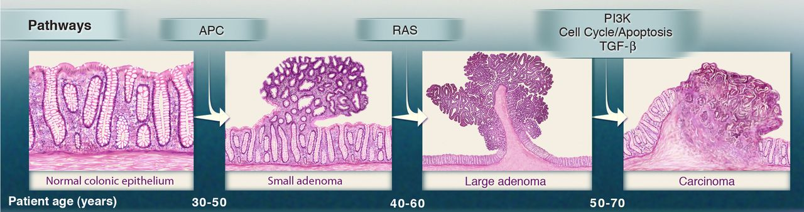

<!-- Limit image width and height -->

<!-- Center image on slide -->

<!-- Italic -->

<!-- Bold -->

--- .segue .dark .nobackground
## Recap

--- .segue .dark .nobackground
## Mitmeastmeline vähiteke

---
## Kasvaja progressioon

- Pahaloomulise vähi teke on pikaajaline protsess, mis tavaliselt võtab aega aastakümneid.
- Protsessi mille jooksul normaalsed rakud omandavad järk-järguliselt neoplastilise fenotüübi nimetatakse **vähi/tuumori/kasvaja progressiooniks**.
- Kasvaja progressioon põhineb rakkudes järjestikustelt akumuleeruvatel juhuslikel geneetilistel või epigeneetilistel mutatsioonidel rakkude jagunemist, ellujäämist ja muudes pahaloomulist fenotüüpi reguleerivates geenides.
- Iga järgnev mutatsioon kujutab endast järgmise barjääri murdumist pre-maliigse raku teel pahaloomulise kasvuni.

---&twocol
## Vähiteke on pikajaline protsess

- USA andmete põhjal on 70 a. mehel 1000 korda kõrgem risk surra käärsoole vähki kui 10 a. poisil.
- Sporaadiline vähk on vana ea haigus ja sellest lähtuvalt võtab pahaloomulise vähi teke ilmselt aega kümneid aastaid.

***=left

 

***=right

 

<footer class="source"> Andmed: Vasakul, 
<a href="http://www.cancerresearchuk.org/cancer-info/cancerstats/incidence/age/">
Cancer Research UK
</a> ja paremal, 
<a href="http://seer.cancer.gov/csr/1975_2011/browse_csr.php?sectionSEL=2&pageSEL=sect_02_table.07.html#table1">
SEER Cancer Statistics Review 1975-2011.
</a>
</footer>

---&twocol
## Vähitekke pikaajalisus: suitsetamise mõju kopsuvähi levikule USA-s

***=left

***=right

- Kuni II maailmasõjani oli suitsetamine USA meeste seas vähelevinud.
- 30-35 aastat hiljem, 1970ndate aastate paiku, hakkas kopsuvähi intsidents järsult tõusma.
- Praegu on ülemaailmne kopsuvähi suremus ~1.39 miljonit aastas, tipp peaks saabuma 2020-30-ndtate aastate paiku.

<footer class="source"> Andmed:
<a href="http://www.nature.com/nrc/journal/v1/n1/full/nrc1001-082a.html">
Tobacco and the global lung cancer epidemic.
</a>
</footer>

---&twocol
## Vähi suremus on lineaarselt seotud vanusega

***=right

 

***=left

- Epidemioloogiliselt on vähi suremus lineaarselt seotud vanusega (a) kus a on vahemikus $a^4$ kuni $a^7$, $\lambda(a)=k \times a^{m-1}$.
- Kui sündmuse tõenäosus on $a^n$, siis sellise sündmuse toimumiseks peab enne aset leidma *n+1* juhuslikku sündmust (*m*) suhteliselt sarnaste ajaliste vahedega.
- Keskmine tõus (*m-1* või *n*) kõrvalolevate andmete põhjal on **5.4** (vahemik: *1.6, 8.0*).
- Siit nähtub, et pahaloomulise vähi tekkeks on vaja keskmiselt 5+1 = **6 sõltumatut sündmust**. 

<footer class="source"> Andmed:
<a href="http://globocan.iarc.fr/Default.aspx">
GLOBOCAN 2012, IARC - 10.11.2014.
</a>
</footer>

---&twocol
## Tee vähini võtab tavaliselt palju aega

- Soolevähi intsidents tõuseb tugevalt seitsmendal ja kaheksandal eludekaadil.
- Seega, iga samm või sündmus vähi suunas toimub kord **5 kuni 10 aasta** jooksul.
- Kogu protsess võtab aega 20 kuni 40 aastat.
- Siit nähtub, et **koos vanusega tekib meisse kõigisse paratamatult ka rakke, mis on juba läbinud mingi arvu (kuid mitte kõiki!) vähi tekkeni viivaid astmeid**.

 

---
## Osa vähke ei sõltu vanusest

- Inimse mesotelioomide (vasakul, tekib asbesti sisse hingamisel ja suitsetamisest) ja hiire nahavähi (benzo[*a*]püreeniga naha värvimisel) epidemioloogiline analüüs näitab, et **välised kantserogeenid on võimelised vähki indutseerima kindla ajakava alusel**.
- Ka kopsuvähi intsidents sõltub pigem suitsetamise staazist kui vanusest ja suitsetamise maha jätmisel risk enam ei suurene. 

<footer class="source"> Pilt:
<a href="http://www.nature.com/nature/journal/v411/n6835/full/411390a0.html">
Cancer epidemiology in the last century and the next decade.
</a>
</footer>

---&twocol
## Somaatiliste mutatsioonide arv inimese vähkides

***=right

- Ülal, mittesünonüümsete mutatsioonide arv tuumori kohta eri paikmetes täiskasvanute ja pediaatriliste vähkide täisgenoomi sekvenerimise andmetel. 
- All, mittesünonüümsete mutatsioonide mediaan erinevates vähitüüpides. Vurrud näitavad diagrammil 25 ja 75% kvartiile. 

<footer class="source"> MSI, microsatellite instability; SCLC, small cell lung cancers; NSCLC, non–small cell lung cancers; ESCC, esophageal squamous cell carcinomas; MSS, microsatellite stable; EAC, esophageal adenocarcinomas. Pilt:
<a href="http://www.sciencemag.org/content/339/6127/1546/F1.large.jpg">
Number of somatic mutations in representative human cancers.
</a>
</footer>

***=left

---&twocol
# Mitmeastmelise vähi histopatoloogia: soolevähk

***=left
- Tuumorid arenevad aja jooksul healoomulisest seisundist kartsinoomideni akumuleerides mutatsioone.
- Kõige esimene *"gatekeeping"* mutatsioon annab jagunevale normaalsele epiteelirakule selektiivse eelise.
- Soolevähis toimuvad sellised *gatekeeping* mutatsioonid **APC** geenis (LOH kr. 5q). 

***=right

- Selline adenoom kasvab aeglaselt, kuid **sekundaarne KRAS mutatsioon** põhjustab teise ringi klonaalse ekspansiooni (kasvu). 
- Ainult APC mutatsiooni kandvad võivad küll alles jääda, kuid nende arv on väike võrreldes APC-KRAS mutantidega. 
- Edasised klonaalsed ekspansioonid on seotud mutatsioonidega PIK3CA, SMAD4 (LOH kr. 18q21) ja TP53 (LOH kr. 17p) geenides ning viivad pahaloomulise vähi tekkeni.

<footer class="source"> Pilt:
<a href="http://www.sciencemag.org/content/339/6127/1546.full">
Cancer Genome Landscapes.
</a>
</footer>

---
## Juht-mutatsioonid ja reisija-mutatsioonid

- Mutatsioonid, mis annavad tulevasele vähirakule selektiivse eelise nimetatakse "juht" mutatsioonideks (*driver*).
- Enamus mutatsioone (>99.9%), mis vähis tekivad ei oma selektiivset tähtsust ja lihtsalt kanduvad "reisijatena" (*passenger*) edasi (sh. punktmutatsioonid, koopiarvu muutused, translokatsioonid ja epigeneetilised muutused üle terve genoomi).
- Iga juhtmutatsioon annab tulevasele vähirakule lisa 0.4% suuruse tõusu jagunemise ja apoptoosi vahekorras, mis ühe-kahe jagunemise korral nädalas viib aastate jooksul suure vähimassi ($>10^9$ rakku) tekkeni.
